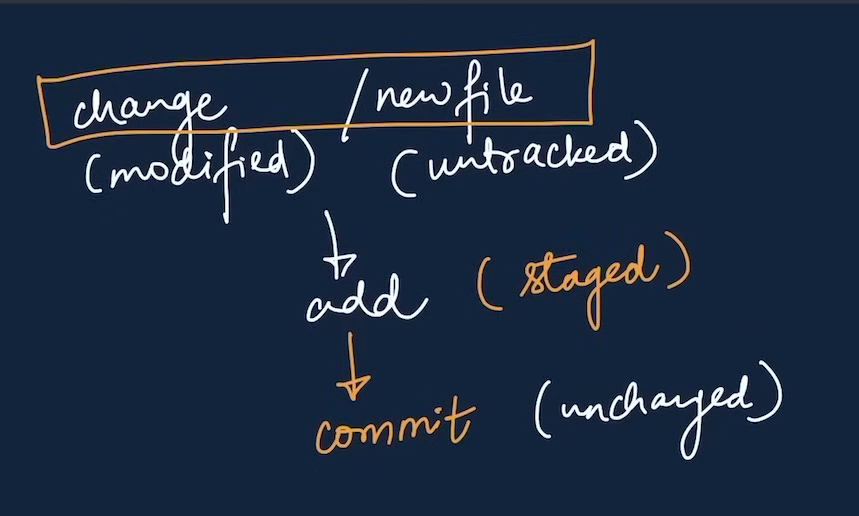

# gitlearn
Learning git and GitHub

**CLONE** 
Cloning our repo in local machine 
git clone <-link->  

**cd**  
Change directory 
**LS (lower case)** 
List all   

**Add** 
Add new or changed files  
*git add <-file name->*  
**Commit** 
It is the record of changes  
_git commit -m "some message"_ 

**Status** 
Show status of code  
_git status_  

*Types of Status* 
- **untracked:**  new files that git don't track yet
- **modified:**  changed
- **unmodified:**  unchanged
- **staged:**   file is ready to be committed\

 
 

