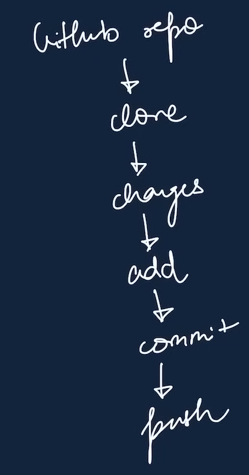

# gitlearn
Learning git and GitHub

**CLONE** 
Cloning our repo in local machine 
git clone <-link->  

**cd**  
Change directory 
**ls(Ls)** 
List all   

  **Status** 
Show status of code  
_git status_  
*Types of Status* 
- **untracked:**  new files that git don't track yet
- **modified:**  changed
- **unmodified:**  unchanged
- **staged:**   file is ready to be committed\

 

**Add** 
Add new or changed files  
*git add <-file name->*  

**Commit** 
It is the record of changes  
_git commit -m "some message"_ 

**Push Command**  
upload local repo to cloud or GitHub  
_git push origin main_  
Here, Origin refers to original Github repo which we forked or copy  
And main refers to branch.  

**Init Command**  
used to create new git repo  
_git init_ :Used to initialize git to new repo  
_git remote add origin <-link-> : wanna add new github repo with name origin at link of required link_  
_git remote -v_: to verify remote repo  
_git branch_ : to check branch (by default- master)   
_git branch -M main_ : to rename branch   
_git push-u origin main_ :Here, -u means to upstream. to not repeatedly write origin main  

**WORKFLOW**  

**GIT BRANCHES Command**  
_git branch: to check branch   
git brach -M main: to rename branch     
git checkout <-branch name->: to navigate  
git checkout -b  <-new branch name->: to create new branch  
git branch -d <- branch name->: to delete branch_    

**Merge Command**  
_git diff <-branch name->: to compare commits, branches, files   
git merge <-branch name->: to merge two branches_  
Or create a Pull Request:  
it tells you about the changes pushed to a branch in repo on GitHub  

**Pull command**  
to fetch content from remote repo to local repo  
_git pull origin main_  

**Merge Conflicts**  
An event that takes place when Git is unable to automatically resolve differences in code between two commits  

**Undoing Changes**  
**Staged Changes**  
_git reset <-file name->  
git reset_  

**Commited Changes(for one commit)**  
_git reset HEAD ~1_  

**Commited Changes(for many commit)**  
_git reset <-commit hash->  
git reset --hard <-commit hash->_  
Note: commit hash is a code for each changes made. It can be accessed thorugh _git log_  

 

